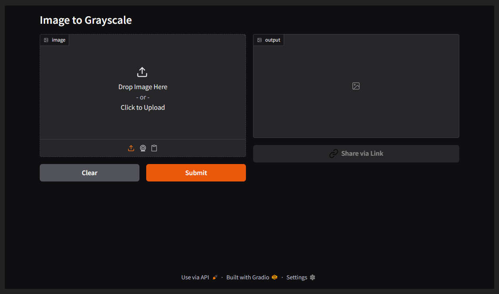

---
title: Grayscale Demo
emoji: 🏆
colorFrom: indigo
colorTo: red
sdk: gradio
sdk_version: 5.39.0
app_file: app.py
pinned: false
short_description: Convert your images to grayscale using a simple Python scrip
---

Check out the configuration reference at https://huggingface.co/docs/hub/spaces-config-reference
